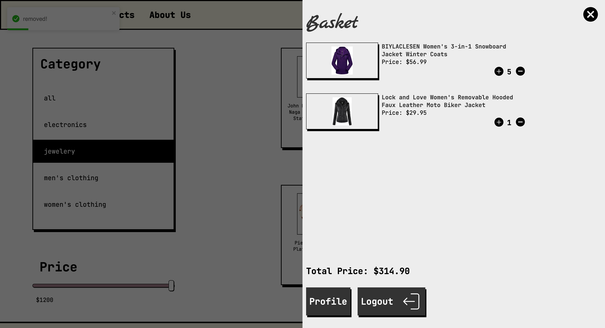

# React-e-commerce website

### The e-commerce website I built to learn Reactjs

## Technologies and libraries I used:

- Firebase Auth for user registration and login processes.
- Firebase Auth for signing in with Google and Facebook accounts
- Firebase Firestore as the database
- ContextApi for state management.
- Fakestore API for product data
- Formik and Yup for form validations
- SCSS for styling

## PAGES AND FEATURES

- You can search through the input in the header and go to the search page by pressing the enter button
  

- You can add products to the cart and update the quantity of the product in the cart.
  

- products page, You can select a category and sort by price also add your wishlist
  
- product popup
  
- You can see your wishlist from your profile. You can remove the products.
  
